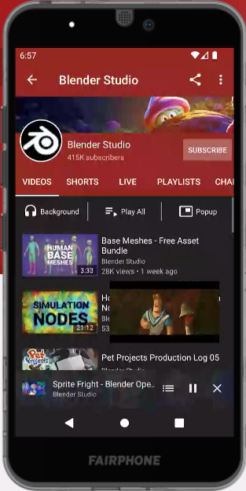

# NewPipe nuevo youtube sin anuncios

Es una alternativa a la aplicaccion de youtube en tu celular _Android_ es rapida y facil de usar.

Si hablamos de clientes alternativas de YouTube, hay principalmente dos tipos. Aquellos que como Vanced se basaban en parchear la aplicación oficial para quitar o poner cosas y aquellos que se basan en la web de YouTube. NewPipe pertenece a este segundo grupo y es una de las mejores aplicaciones para ver YouTube que no son la propia app de YouTube.

hacemos la descarga desde el celular donde queramos instalar la aplicación.

### Descarga

[NewPipe APK](https://archive.newpipe.net/fdroid/repo/NewPipe_v0.25.2.apk)

### Recuerda Habilita el “origen desconocido”

De manera predeterminada, tu dispositivo Android no permite la instalación de aplicaciones distribuidas fuera de sus tiendas autorizadas.
Por lo general te sale un anuncio diciendo que no puede instalar la aplicación y que tienes que habilitarlo, le das click en el botón habilitar y te llevara al menú de opciones donde debes escoger la aplicación que estas usando para instalar, le das los permisos y listo. Continuas con la instalacion.
